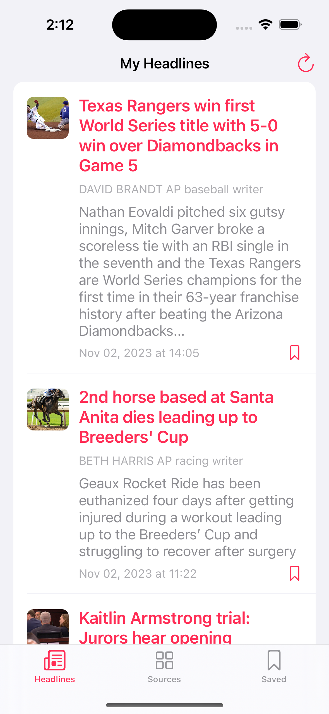
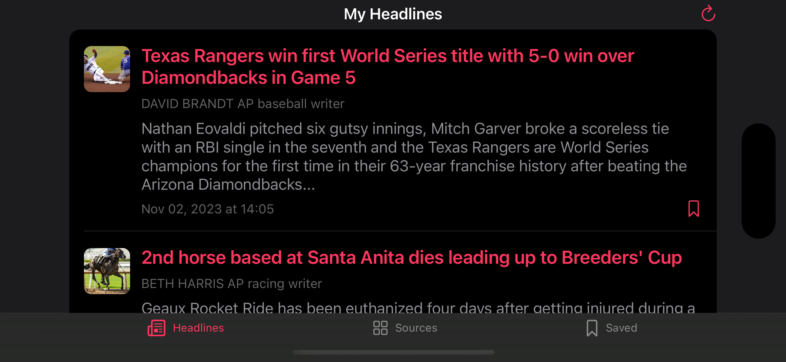

# LukeNewsApp

## Introduction

This project was developed as part of a coding challenge for an interview process. Within a span of two days, I endeavored to fulfill as many requirements provided by Medibank as possible. Any shortcomings are acknowledged, and I welcome constructive feedback at any time.

This app perfectly supports night mode and also supports screen rotation.

## Features

This app is a news browsing application with three main screens: Headlines, Sources, and Saved.

- Headlines Screen: 
Here, users can view headlines from their selected news sources. Users can also save or unsave news articles by tapping the bookmark button on each news item. A refresh button located in the top-right corner of the screen allows users to refresh the content at any time or after changing their news sources on Sources screen. Tapping on a news article summary redirects the user to a SafariViewController to view the complete news article link.

- Sources Screen: 
Users can browse through all the news sources offered by NewsAPI. The app defaults to selecting 'ABC News' first, but users can choose multiple or remove selected news providers during their session. Please note that the app requires at least one news provider to be selected. Similar to the Headlines screen, there is a refresh button in the top-right corner to refresh the data when needed.

- Saved Screen: 
This screen displays the news that the user has saved previously. Users can also remove news articles from their saved list here. As with Headlines screen, tapping on a news article summary will open the corresponding full news link in a SafariViewController.

## Screenshots

## Technologies

### Language

Swift

### Design Pattern

MVVM

### Data Persistence

Currently, all data that requires saving is persisted using UserDefaults. I am well aware that UserDefaults is not the optimal choice for larger sets of data. Given more time, my plan would be to integrate the Realm database for robust data storage and to incorporate RxRealm for reactive data persistence operations.

### Libraries

In this project, I deliberately limited the use of third-party libraries to showcase my proficiency in native UIKit development. The libraries included are essential and widely utilized across various companies. They are:

- RxSwift
- RxCocoa
- SnapKit
- Kingfisher

## Testing

With the time constraints in mind, I focused on writing unit tests for critical parts of the application including the Network layer, Repository layer, and ViewModel layer. This ensures that the key components of the app that handle data fetching, data storage, and business logic are tested for reliability and stability.
